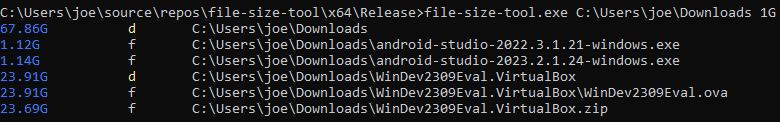

# File Size Tool

This is a lightweight tool for Windows that reports files and directories over a given size.
The release binary is 11KB, and the program uses little memory.

## Building

I developed this in Visual Studio 2022. You really only need the MSVC compiler and a few
import libraries that should come with any modern Windows.

## Running

Run the binary with no arguments to get some usage info. You need to provide a directory to scan
and a size threshold:

```batch
> file-size-tool.exe C:\files 1G
```

If nothing goes wrong, the tool will print a list of files and directories (including the given
directory), with their sizes on the left:



The sizes of directory entries are not included.

## License

file-size-tool is licensed under the GNU General Public License 3 or any later version at your choice.
See [COPYING](https://github.com/Dezzmeister/file-size-tool/blob/master/COPYING) for details.
